# Maker Space Bambu Labs P1S user guide

- [Useful links](#useful-links)
- [Bambu Studio setup](#bambu-studio-setup)
  - [Install](#install)
  - [Add printer](#add-printer)
- [Loading, Unloading and Configuring Filament](#loading-unloading-and-configuring-filament)
  - [Unloading](#unloading)
  - [Loading](#loading)
    - [Bambu Lab filament](#bambu-lab-filament)
    - [Generic filament on card spools](#generic-filament-on-card-spools)
    - [Generic filament](#generic-filament)
- [Printing](#printing)
  - [Preparing printer](#preparing-printer)
  - [Preparing and starting job](#preparing-and-starting-job)
  - [End of job](#end-of-job)
- [SD card](#sd-card)

## Useful links

- [Bambu Lab wiki](https://wiki.bambulab.com/en/home)

## Bambu Studio setup

### Install

1. Install and launch [Bambu Suddio](https://bambulab.com/en/download/studio)
2. Click "Get Started"  
   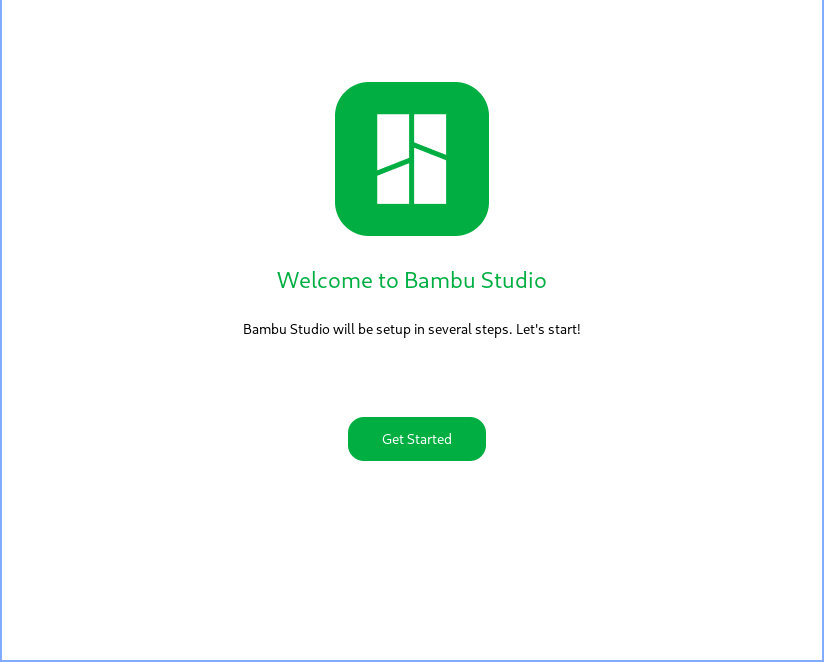
3. Select "Europe"  
   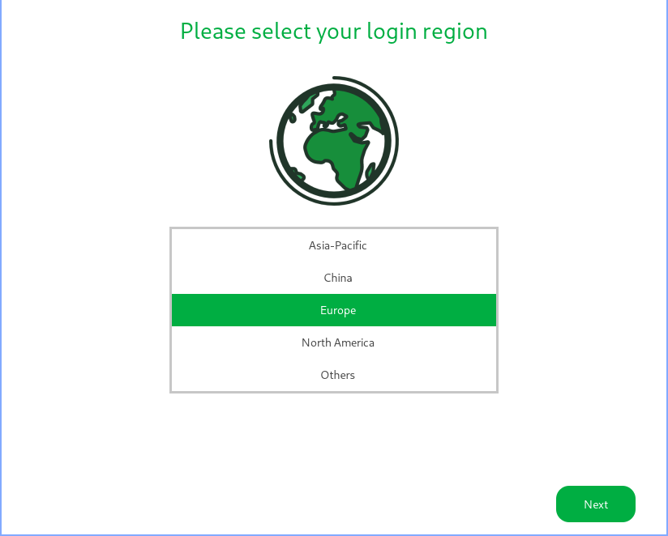
4. Select "Skip"  
   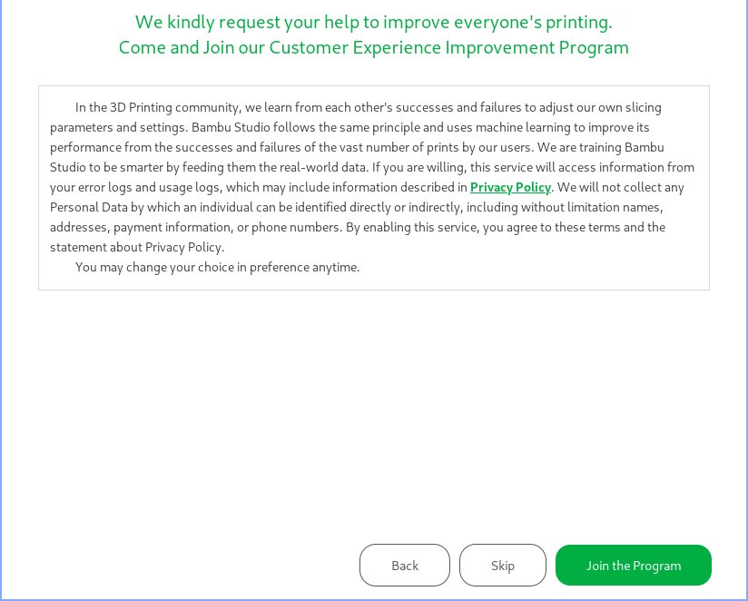
5. Select "Clear All"  
   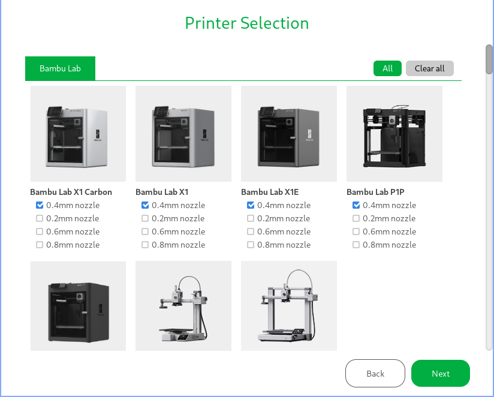
6. Check "Bambu Lab P1S 0.4mm nozzle" and click "Next"  
   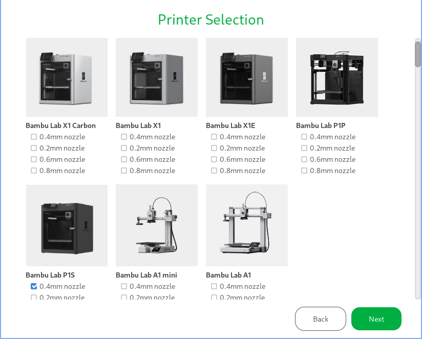
7. Customise the filament selection if needed, otherwise just click "Next"  
   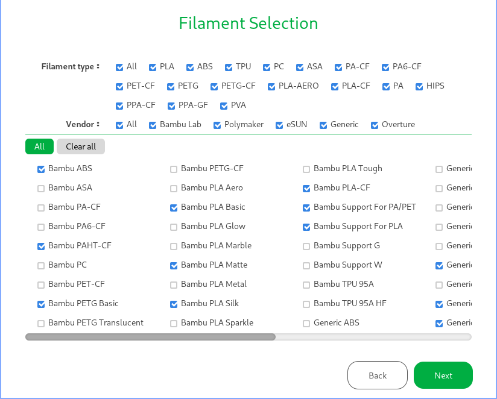
8. Ensure "Install Bambu Network plug-in" is checked and click "Finish"  
   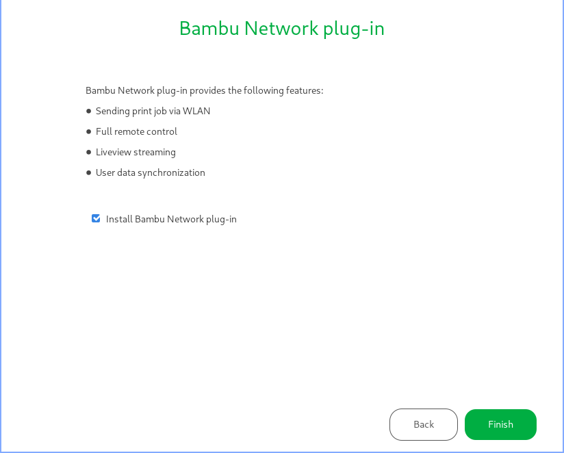

### Add printer

1. Switch to the "Devices" tab  
   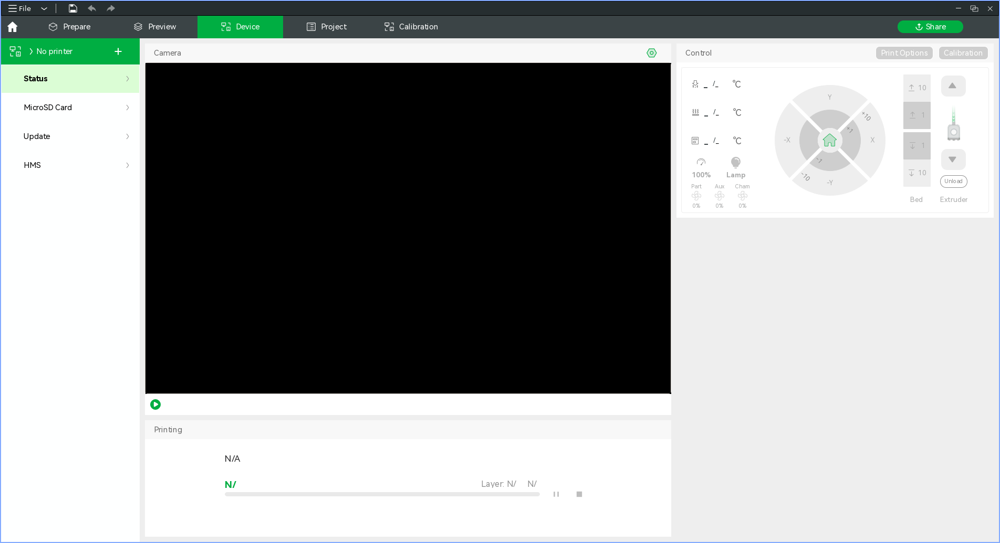
2. Click on "No printer" and select "3DP-01P-744" from the list
3. When prompted enter the code from the printer menu as instructed  
   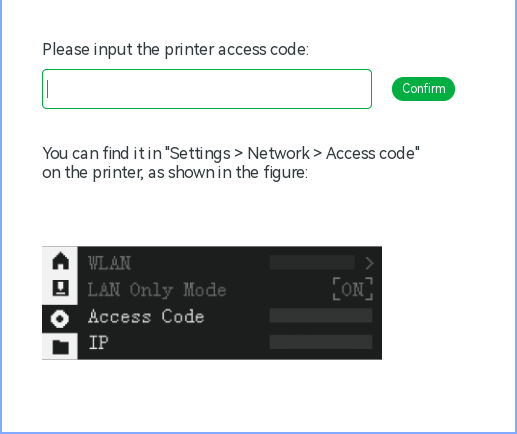
4. The printer status should now be shown in the "Device" tab  
   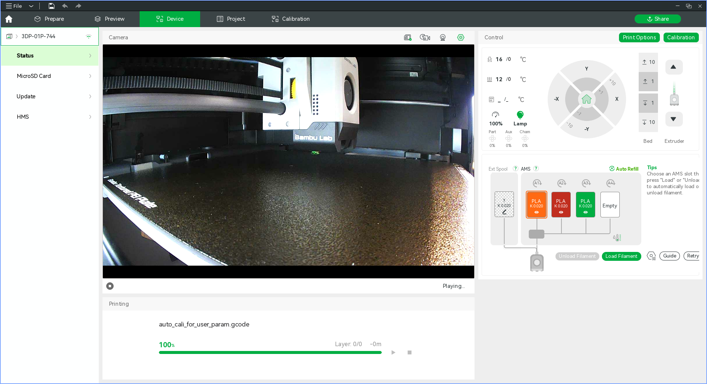

If you do not see the printer in the device list then mostl likely your machine is not properly configured to act as an SSDP client.
See [Simple Service Discovery Protocol](https://en.wikipedia.org/wiki/Simple_Service_Discovery_Protocol) and [Printer Network Ports](https://wiki.bambulab.com/en/general/printer-network-ports) for more info.
TL;DR: open UDP port 2021 on your machines firewall and try again.

When getting the access code from the printer do not select the refresh icon next to the code.

## Loading, Unloading and Configuring Filament

### Unloading

1. Ensure the filament you wish to remove from the AMS is not currently loaded into the printer
2. Pull the filament out of the AMS feeder and lift the spool out

You can tell if a filament is loaded into the printer either by:

- Observing the tube connecting the AMS to the printer, if you cannot see the filament in question inside the tube then it is *probably* unloaded
- Checking the diagram on the "Device" tab in Bambu Studio, if the line leading from the spool position is thin and grey then the filament is unloaded

### Loading

#### Bambu Lab filament

1. Place the spool in a free AMS slot
2. Push the filament into the AMS feeder for the corresponding slot
3. Wait 30 seconds or so for the filament to be identified
4. Verify that the filament was correctly identified via the "Devices" tab in Bambu Studio

#### Generic filament on card spools

Filament on card spools should NOT be used directly in the AMS, the spool rollers chew up the card spools and make a mess of the AMS.

A [shim](https://www.printables.com/model/251028-cardboard-spool-ring-for-bambu-lab-ams-parametric/) can be printed to protect the edges of the card spool.

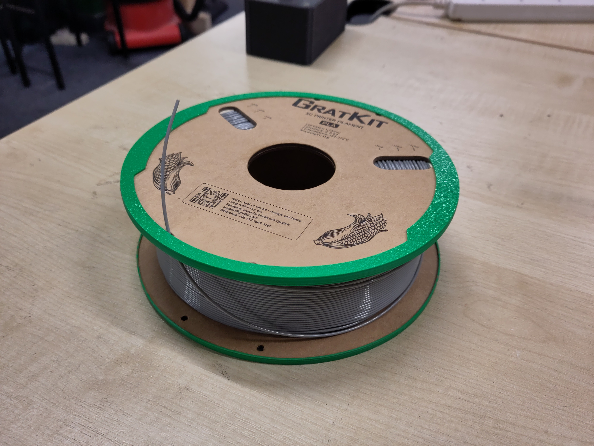

Some cardboard spools, once clad with a printed shim, are too wide for the lid of the AMS to be closed without clamping the spool and preventing it from moving.
In this case the clips on the AMS lid may be used to prop the lid slightly open as shown below.
This should only be done when a filament is loaded into the AMS that would otherwise foul the AMS lid, prefer closing the lid when possible to take advantage of the humidity control offered by the AMS.

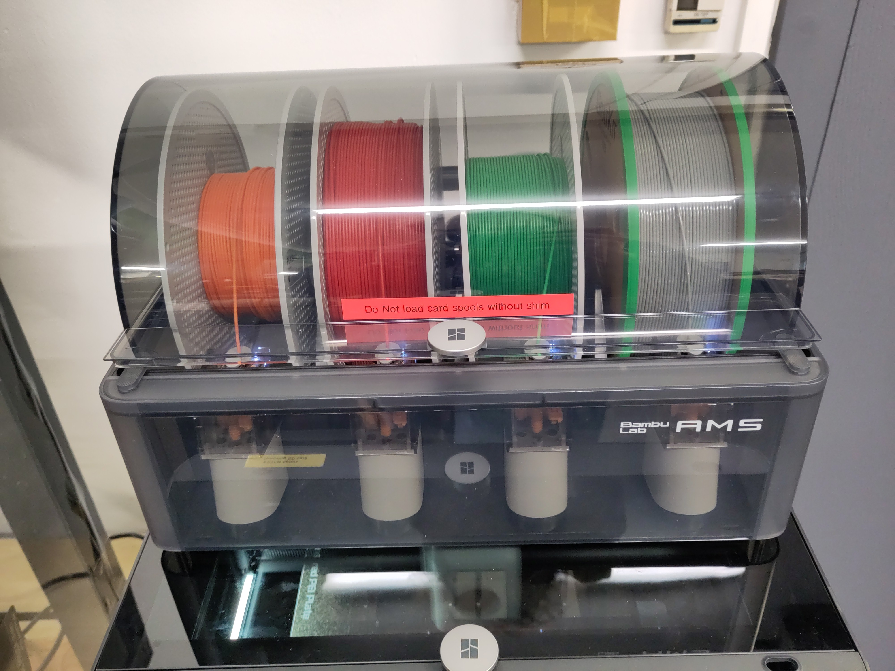

#### Generic filament

1. Place the spool in a free AMS slot
2. Push the filament into the AMS feeder for the corresponding slot
3. In the "Device" tab of Bambu Studio, click the edit icon on the just loaded AMS slot (may show either an "?" or the settings for the last non RFID filament used in that slow)  
   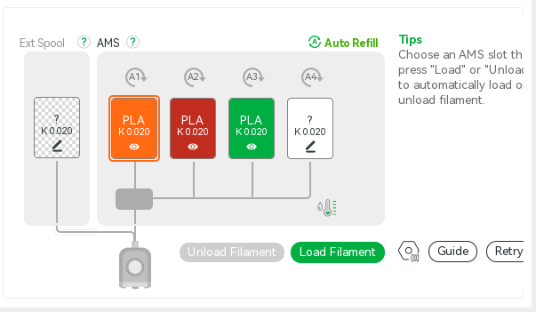
4. Edit the parameters and click "Confirm"  
   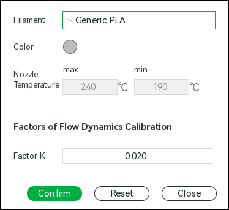
5. The "Devices" tab should now show the filament type you specified  
   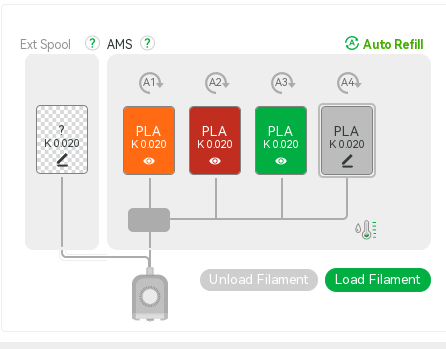

## Printing

### Preparing printer

1. Ensure there are no obstacles above or below the bed and that the build plate is correctly seated, located by the white tabs on the rear corners (highlighted in red squares in the photo below)  
   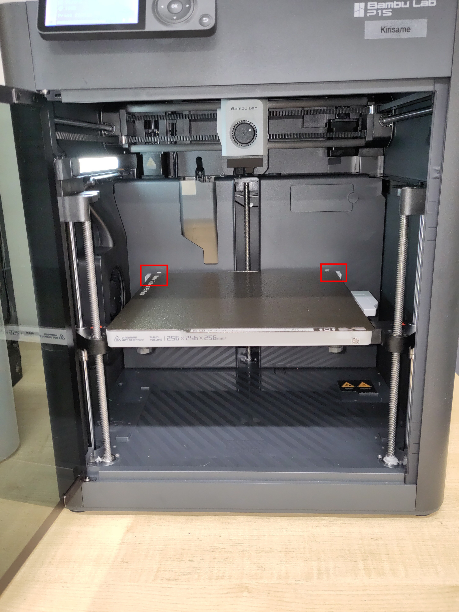
2. If you need to change filaments in the AMS, do so now

### Preparing and starting job

1. Load designs into the "Prepare" tab of Bambu Studio  
   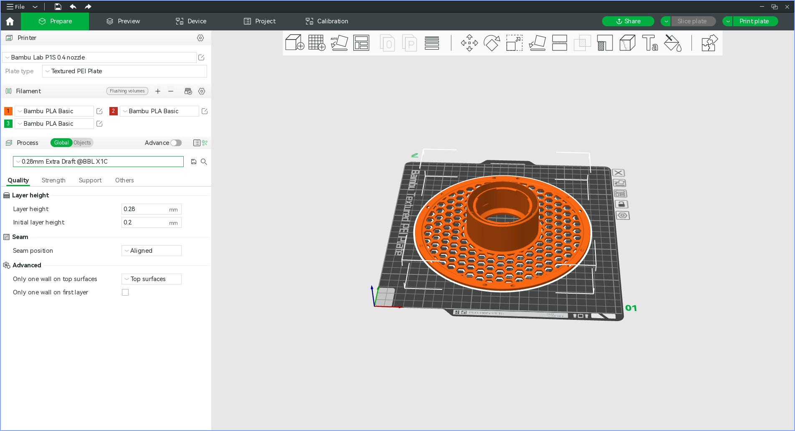
2. Synchronise local filament settings with AMS by clicking the  button on the filament settings panel, this will ensure your local filament settings reflect what is currently available on the printer
3. Set machine, material and slicing settings in the left hand pane (yes the slicing profiles say "X1C", as far as I can tell this is fine)
4. Click "Slice plate"
5. You will see a preview in the "Preview" tab  
   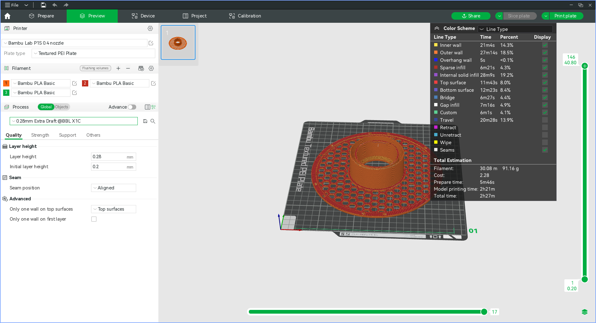
6. If all is well, press "Print plate"
7. Set options as desired, if you forgot to set the filament for your part you can override this here, disable timelapse if you have no intention of retrieving it, keep bed levelling and AMS enabled  
   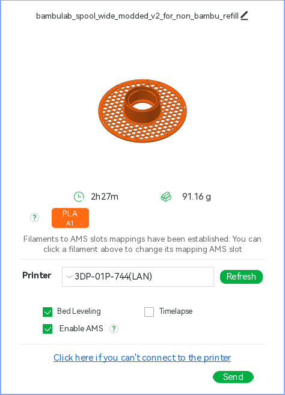
8. Click "Send"
9. Wait for the job to be uploaded  
   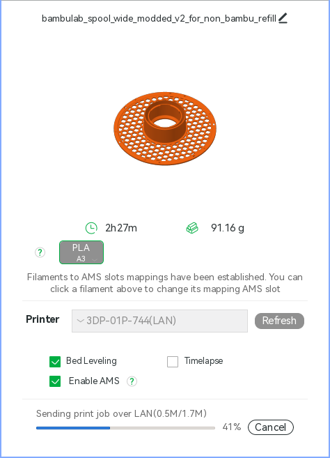
10. The "Device" page is automatically shown where you can monitor the jobs progress, adjust settings and temperatures if needed and pause or cancel the job
11. It is worth checking that the purge filament has not ended up on the build plate, this should not happen but it is worth keeping an eye out for

### End of job

1. Remove build plate from printer
2. Remove part from build plate
3. Reseat build plate in printer
4. Clean up any filament the printer has deposited (check the purge chute at the rear of the machine)

## SD card

The micro SD card is used for storing print jobs, timelapse and camera recordings (amongst other things that are of little direct use to humans).

It is not advised to use the SD card as a means of getting print jobs onto the machine.

Removing the SD card is how you would get timelapses and camera recordings off the printer, however if you wish to do this then immediately return the card to the printer as removal of the card renders it inoperative.

Should the card be out of space, it can be safely formatted in the printer using the on screen menu.
